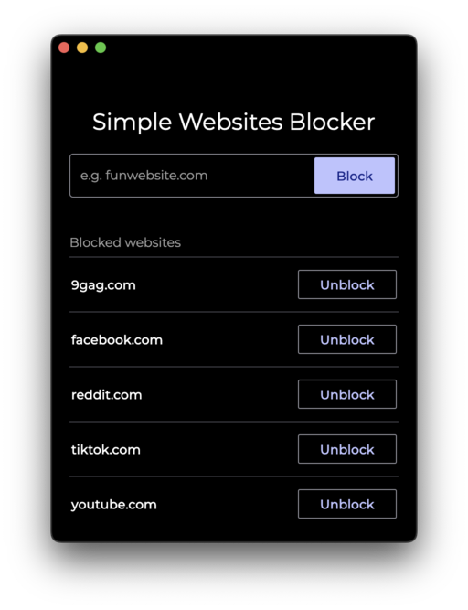
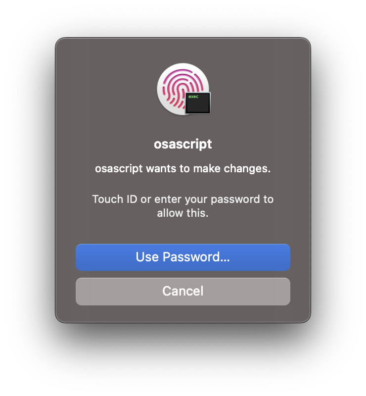

# Simple Website Blocker

## How does it work?

### MacOS / Linux

#### Adding:
1. The user enters the site address (in any format, such as `site.com` or `https://www.site.com/subpage`)
2. A domain is extracted from the address (e.g. `https://www.site.com/subpage` -> `site.com`)
3. Address variants are created:  
`<domain>`, `www.<domain>`, `http://<domain>`, `https://<domain>`, `http://www.<domain>`, `https://www.<domain>`
4. The user must authorize the operation so that the application can edit the `/etc/hosts` file
5. If it is the first addition, the fragment `# SimpleWebsitesBlockerStart#\nSimpleWebsitesBlockerEnd` is added to the `/etc/hosts` file
6. All variants are placed in the `/etc/hosts` file between the application tags (`# SimpleWebsitesBlockerStart`, `# SimpleWebsitesBlockerEnd`)

#### Removal:
1. The user clicks on the `unblock` button next to the domain
2. Address variants are created:  
`<domain>`, `www.<domain>`, `http://<domain>`, `https://<domain>`, `http://www.<domain>`, `https://www.<domain>`
3. The user must authorize the operation so that the application can edit the `/etc/hosts` file
4. All variants are removed from the `/etc/hosts/` file

## Authorization examples

### MacOS

